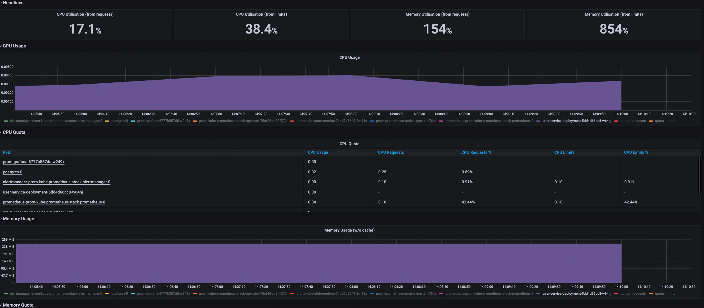
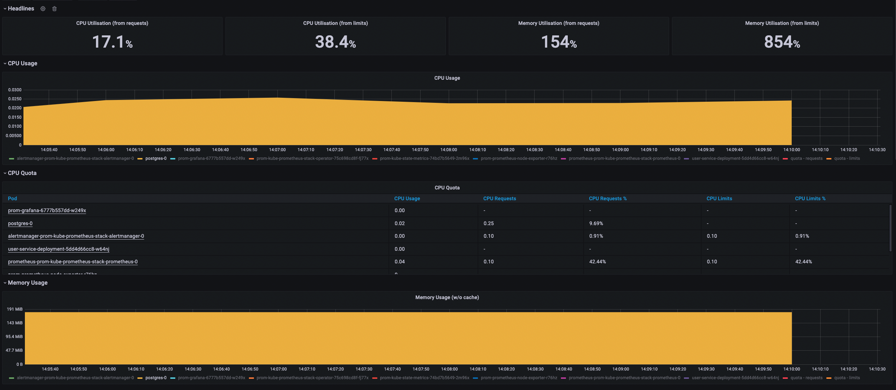
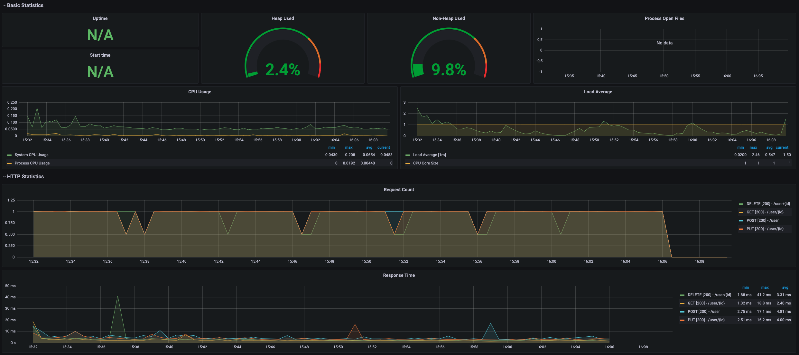
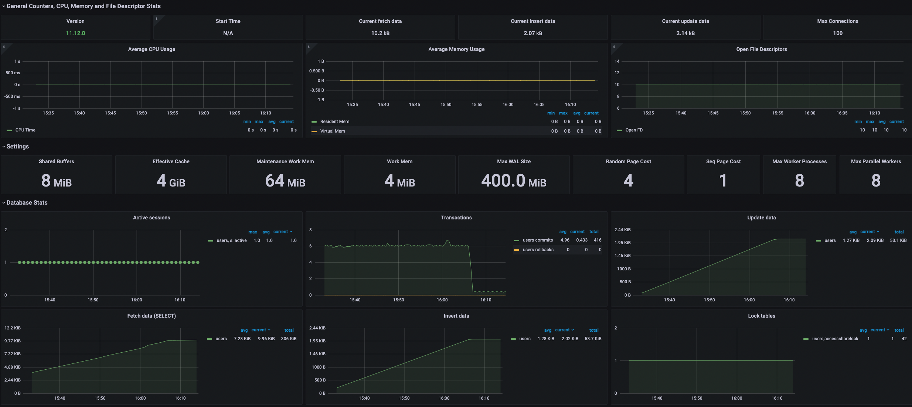

### Задание №3

Запуск приложения: `bash ./service.sh install`

После запуска нужно запустить скрипт тестирования: `bash ./service.sh test`

Остановка приложения: `bash ./service.sh destroy`

Графана находится по хосту arch.homework.grafana (ip kubernetes, ingress-controller настроен не через helm)

После авторизации (login:admin pass:prom-operator) нужно импортировать дашборды (в yml файл не поместились)

./postgres-dashboard.json

./user-service-dashboard.json

---
Информация о подах: `http://arch.homework.grafana/d/85a562078cdf77779eaa1add43ccec1e/kubernetes-compute-resources-namespace-pods?orgId=1&var-datasource=Prometheus&var-cluster=&var-namespace=default&refresh=5s&from=now-5m&to=now`

Информация о postgres: `http://arch.homework.grafana/d/DodSvSWnk/postgresql-database?orgId=1&refresh=5s&from=now-15m&to=now`

Информация о приложении: `http://arch.homework.grafana/d/NGYHvIZnz/userservice?orgId=1&refresh=10s`

[Коллекция postman](./OtusHomework2.postman_collection.json)

###UserService POD

###Postgres POD

###UserService

###Postgres

